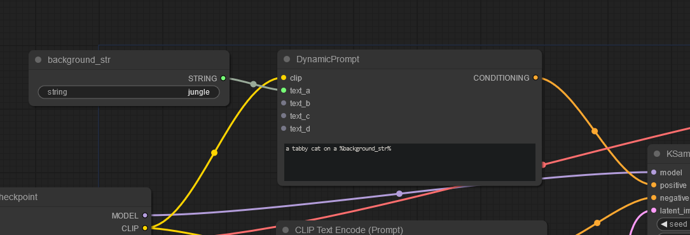

# Web API Suite

A set of custom nodes for use with processing images for the web, for example in web apps. With it, you can load images from a url, and then save images to a url (instead of in the local file storage of the server).

Use case: You want to run ComfyUI on a service like RunPod, and deploy your web app on a different cloud service (ie: serverless).

Feel free to suggest any improvements either in the Python code or the documentation.

## Load Image from URL

Replacement for LoadImage; this node will download an image from a url and temporarily store it into the input folder, once loaded into the queue, will be removed to save space.

### Parameters:

_url_

- the url of the image

_save_name_

- temporary name to use when downloading the file (if not keeping the image, probably doesn't matter much)

_save_format_

- the format to save the downloaded image as, such as 'png' jpg', etc

_input_dir_

- the directory where the image will be temporarily stored, defaults to the same folder used by ComfyUI in /inputs

_keep_

- if set to true, will keep the file in the local system instead of removing it.

## Save Image to URL

Replacement for SaveImage, but will attempt to upload the resulting image to a url

### Parameters:

_filename_prefix_: same as [SaveImage](https://blenderneko.github.io/ComfyUI-docs/Core%20Nodes/Image/SaveImage/)

url: the request url

presign_key: if the server returns a JSON object, then this is the key that should be referenced; otherwise leave blank if the server returns the url as text

```
// Leave blank when response is just text, example:
GET /api/foo -> 'http://presignedurl.com'

OR set the key when JSON is returned:
GET /api/bar -> {
	url: 'http://presignedurl.com'
}
```

method: either post or put, defaults to post,

_headers_

- insert headers here as a string (which gets converted to JSON via `json.loads(headers)`. Useful if you have some authentication tokens, or want to define anything else that will be seen by the server.

_callback_api_

- the url to use if you want to send the response of the upload to an external API. Useful if you want to process additional information such as saving it as a record in a database with status "complete" when the image has completed uploading, and if your cloud provider gives additional info on the image such as public id.

## Dynamic Prompt

A mustache-like prompt builder, drop in replacement for the original CLIP Text Encode.

### Example



- Create a Dynamic Prompt node and type in your prompt in the multiline text input while putting in the variable referencing a variable string node you want to replace within %'s, for example, "a tabby cat on a %background_str%"
- Create a string node, you can use Simple String from Use Everywhere or Text to String from WAS Node Suite, and give it a unique name, like "background_str", then give it a value, ie: "sandy beach". Then connect this node to any of the inputs of Dynamic Prompt, this is done so that when the string node is updated, it will re-run this process, because a connected node has changed, otherwise it would be cached.

## Dynamic Text

Same as Dynamic Prompt but it outputs text instead.

### Example


- The output of Dynamic Text will be "a tabby cat on a sandy beach" as text, so you will need to connect it to "Text to Conditioning" from WAS Suite to then convert to conditioning.
